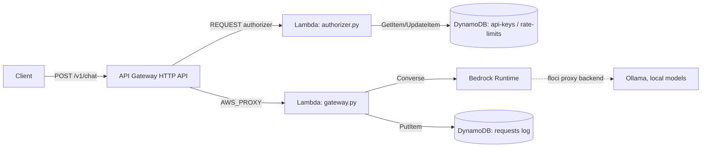

# LLM Gateway on AWS


A serverless LLM gateway built on AWS — API Gateway → Lambda → Bedrock Runtime — defined entirely as Terraform IaC and developed **without any AWS costs** using [floci](https://floci.io) (a local AWS emulator) and [Ollama](https://ollama.com) for real local model inference.

The same Terraform code that runs against floci locally deploys unchanged against real AWS.

## What it does

- Accepts chat requests over HTTP (`POST /v1/chat`) via API Gateway
- Routes them to different "Bedrock models" via a `modelId` parameter — backed locally by different Ollama models, in production by real AWS Bedrock
- Authenticates requests with API keys and enforces per-key rate limits via a custom Lambda authorizer
- Logs every request (tokens, latency, estimated cost) to DynamoDB
- Ships with a CI pipeline that validates the Terraform code and runs a full end-to-end smoke test against floci on every push to `main`

## Architecture



**In production**, the Bedrock Runtime call goes straight to real AWS Bedrock — no code changes required, only the Terraform provider's `endpoints` block and floci itself are removed.

## Why floci + Ollama instead of real Bedrock

Running this against real AWS Bedrock during development would mean:
- Paying per token for every test call while iterating on the Lambda code
- Needing an AWS account with Bedrock model access enabled just to try things out
- No easy way to run the same test suite in CI without real credentials and real spend

[floci](https://floci.io) emulates AWS services locally (API Gateway, Lambda, DynamoDB, IAM, Bedrock Runtime, and more) via Docker, running real Lambda runtime containers rather than mocking them. Its Bedrock Runtime service supports a **proxy backend** that forwards `Converse` calls to any OpenAI-compatible endpoint — in this project, [Ollama](https://ollama.com) running small local models (`qwen2.5:0.5b`, `llama3.2:1b`).

**Trade-offs, stated honestly:**
- Small local models (0.5B–1B parameters) produce much simpler answers than real Claude/Bedrock models — this project demonstrates the *infrastructure*, not model quality
- CI runs without Ollama and falls back to floci's built-in stub backend (fixed canned responses) — the smoke test verifies wiring, not real inference
- A couple of floci rough edges were hit and worked around along the way (see [Lessons Learned](#lessons-learned) below)

## Prerequisites

- [Docker](https://www.docker.com/) (with Docker Compose)
- [uv](https://docs.astral.sh/uv/) — Python package/version manager
- [Terraform](https://www.terraform.io/) ≥ 1.9
- [AWS CLI](https://aws.amazon.com/cli/) (used to talk to floci, no real AWS account needed)
- [Ollama](https://ollama.com), with two small models pulled:
  ```bash
  ollama pull qwen2.5:0.5b
  ollama pull llama3.2:1b
  ```

**RAM note:** both models together need roughly 3–4 GB — comfortably runs alongside Docker and a browser even on an 8 GB machine.

## Getting started

```bash
git clone https://github.com/<your-username>/llm-gateway-aws.git
cd llm-gateway-aws

# starts floci, waits for it to be healthy, exports AWS_* env vars for this shell
./scripts/dev-up.sh

# build both Lambda packages (gateway + authorizer)
./scripts/build-lambda.sh

# deploy
cd terraform
terraform init
terraform apply -auto-approve

# seed a test API key
aws dynamodb put-item \
  --table-name llm-gateway-api-keys \
  --item '{"apiKey": {"S": "demo-key-123"}, "rateLimitPerMinute": {"N": "5"}, "owner": {"S": "test-user"}}'
```

## Example request

floci returns a real-AWS-shaped domain for the API endpoint (`https://<api-id>.execute-api.us-east-1.amazonaws.com/...`) that doesn't resolve locally. Calls go to `localhost:4566` instead, with the real domain set as the `Host` header so floci can route the request correctly:

```bash
API_ID=$(terraform -chdir=terraform output -raw api_id)

curl -X POST "http://localhost:4566/v1/chat" \
  -H "Host: ${API_ID}.execute-api.us-east-1.amazonaws.com" \
  -H "Content-Type: application/json" \
  -H "x-api-key: demo-key-123" \
  -d '{"prompt":"Say hello","modelId":"anthropic.claude-3-haiku-20240307-v1:0"}'
```

```json
{"answer": "Hello! How can I help you today?"}
```

## Request logs & cost tracking

Every successful call is logged to DynamoDB with tokens, latency, and an estimated cost (using fictional per-token pricing, since real Bedrock isn't involved locally):

```bash
# All logged requests
aws dynamodb scan --table-name llm-gateway-requests

# Requests for a specific API key, via the apiKey GSI
aws dynamodb query \
  --table-name llm-gateway-requests \
  --index-name apiKey-index \
  --key-condition-expression "apiKey = :key" \
  --expression-attribute-values '{":key": {"S": "demo-key-123"}}'

# Total estimated cost for a given key
aws dynamodb query \
  --table-name llm-gateway-requests \
  --index-name apiKey-index \
  --key-condition-expression "apiKey = :key" \
  --expression-attribute-values '{":key": {"S": "demo-key-123"}}' \
  --query 'Items[].estimatedCostUsd.S' \
  --output text \
| tr '\t' '\n' \
| LC_ALL=C awk '{sum += $1} END {printf "Total cost for demo-key-123: $%.6f\n", sum}'
```

**Note:** `LC_ALL=C` matters here — on a non-English system locale, `awk` may not recognize `.` as the decimal separator and silently treat the values as `0`.

Logging is deliberately **best-effort**: if the DynamoDB write fails for any reason, the Lambda still returns the successful LLM response to the caller rather than failing the request over a bookkeeping error.

## Project structure

```
llm-gateway-aws/
├── terraform/          # all infrastructure as code
│   ├── providers.tf
│   ├── iam.tf
│   ├── lambda.tf
│   ├── api_gateway.tf
│   ├── auth.tf
│   ├── dynamodb_auth.tf
│   ├── dynamodb.tf
│   └── outputs.tf
├── lambda/
│   ├── gateway.py       # main request handler
│   ├── authorizer.py    # API key + rate-limit authorizer
│   └── pyproject.toml   # managed with uv, Python 3.14
├── scripts/
│   ├── dev-up.sh        # starts floci + exports env vars
│   └── build-lambda.sh  # packages both Lambda functions
├── docker-compose.yml   # floci, configured for the Ollama proxy backend
└── .github/workflows/terraform.yml
```

## CI/CD

Two jobs run on every pull request / push to `main`:

- **`validate`** — `terraform fmt`, `validate`, `plan`, and a [Checkov](https://www.checkov.io/) security scan
- **`smoke-test`** — a real `terraform apply` against floci in the CI runner (GitHub-hosted runners have a real Docker daemon, so floci's Lambda containers work the same way they do locally), a live end-to-end request, then `terraform destroy`

## Lessons learned

A few non-obvious things that came up building this, documented here because they cost real debugging time and might save someone else:

- **`bedrockruntime` is not a valid Terraform AWS provider endpoint key** — only `bedrock` (the control plane) exists; the `Converse` call happens entirely inside the Lambda runtime and never touches the Terraform provider's endpoint config.
- **API Gateway silently Base64-encodes the request body** if the client doesn't send an explicit `Content-Type: application/json` header — handle `event["isBase64Encoded"]` in the Lambda handler regardless.
- **`print()` output can be lost** inside Lambda containers due to Python's stdout buffering — use `flush=True` and/or set `PYTHONUNBUFFERED=1`.
- **HTTP API v2 Lambda authorizers return `403`, not `401`**, when `isAuthorized: false` — `401` only happens when the identity source header is missing entirely, so the authorizer is never invoked.
- **floci's returned `invoke_url` looks like a real AWS domain** and doesn't resolve locally — the working approach is sending requests to `localhost:4566` with the real domain set as the `Host` header.
